# Windows系统安装与激活教程

## 写在前面:

本教程以windows 10 系统为例, 其他 windows 7, windows 8.1,系统类似.不过为了让我们能愉快的安装使用,建议使用windows 10操作系统.

### 本教程分为以下几个步骤:

- [安装前准备](#安装前准备)

  - [确认电脑所适用的系统类型](###确认电脑所适用的系统类型)

  - [选择并下载系统镜像](#选择并下载系统镜像)

- [启动盘的制作](#启动盘的制作)

  - [下载制作工具](#下载制作工具)

  - [启动盘的写入](#启动盘的写入)

- [系统的安装](#系统的安装)

  - [从U盘启动](#从U盘启动)

  - [安装系统](#安装系统)

- [系统的激活](#系统的激活)

### 你需要以下设备:

- 一个大于8G或8G以上的u盘 

- 一个可以连接网络的系统正常windows电脑

- 待装系统的电脑

注: 如果待装系统的电脑目前可正常运行，则可以不用第二台电脑

下面来介绍具体的操作步骤

---

## 安装前准备

---

### 确认电脑所适用的系统类型

**如果我们知道电脑适用64/32位操作系统可跳过此步骤**
我们要安装的系统需要与电脑硬件相匹配.下面我们来确认电脑所适用的系统

- 如果您的电脑还可以开机且您的电脑是windows 7系统:
  - 首先右键点击”计算机”,选择属性

    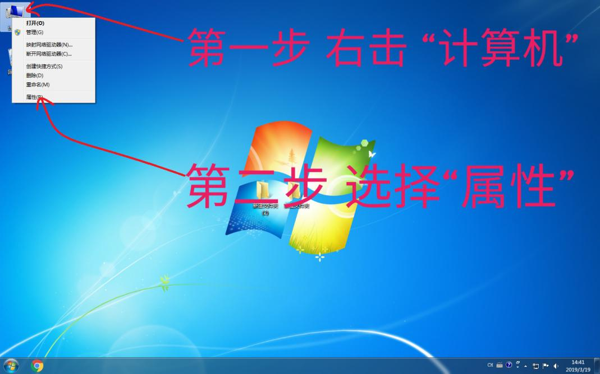

  - 下图中框处表示这台电脑适用64位的操作系统
    
    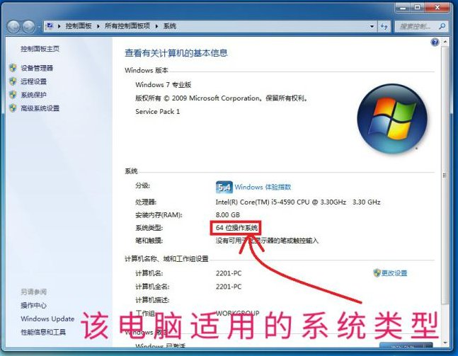

- 如果您的电脑能开机且是windows10系统:

  - 点击windows图标打开开始页面，然后点击齿轮图标进入设置页面
    
    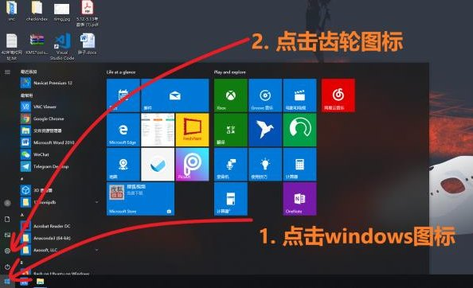
  
  - 点击”系统”
  
    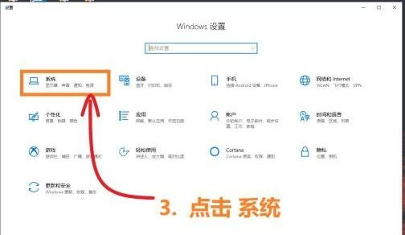
  
  - 点击 “关于”，图中第二个框中表示这台电脑适用64位的操作系统
  
    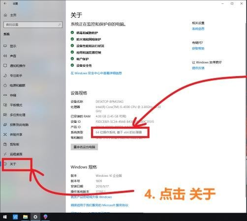

- 如果你的电脑无法开机，搜索 **”CPU型号+指令集“** 以确认你的电脑所适用的系统。
  
**注意**：大多数电脑都是64位的

### 选择并下载系统镜像

- 打开云南大学校园软件[正版化服务平台](http://ms.ynu.edu.cn/)并点击下图中的微软应用下载!

    

- 点击windows 10 专业版

    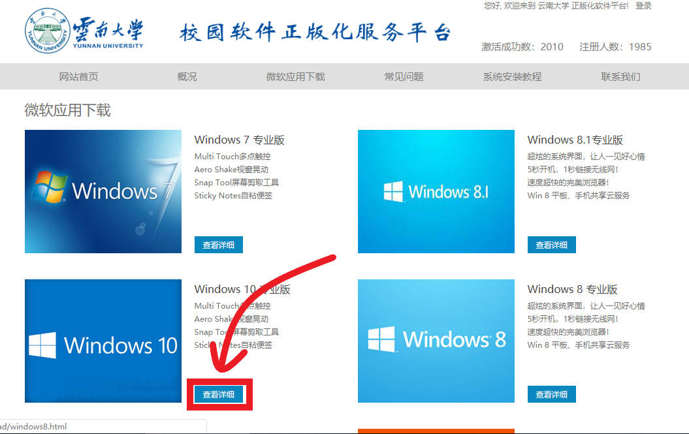

- 点击选择框**选择适用的系统**(此处以64位为例)

    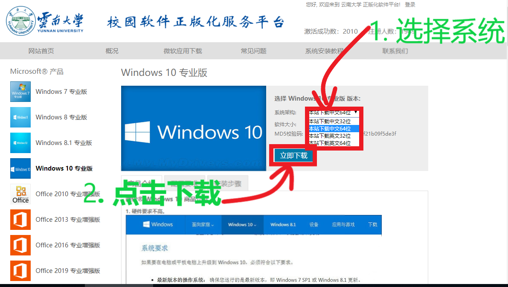

- 点击下载按钮会跳转到统一身份认证页面，填入学号/工号与密码认证

    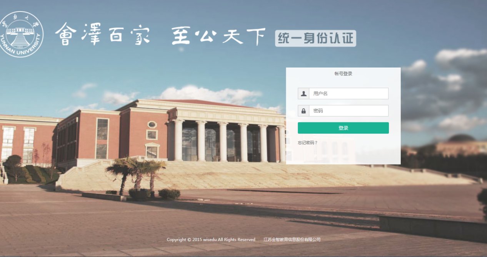

- 认证完成会跳转回下载页面 重新点击即可开始下载
  

---

## 启动盘的制作

---

>什么是启动盘?
我们知道,电脑系统是安装在硬盘上的,实际上启动盘就是在U盘上安装了一个小系统.而这个小系统是来帮助我们 将功能健全的系统安装在其他硬盘. 制作启动盘的过程就是在U盘安装这个小系统的过程.我们在之前下载的win10的镜像包含了这个小系统和完整的windows系统.即这个‘小系统’也就是我们的系统安装程序。
不理解也没关系,只要跟着下面的步骤做就没问题

### 下载制作工具

>Rufus是一个可以帮助格式化和创建可引导U盘（Live USB）的工具，可以制作Windows、Linux、Android-x86 等操作系统的启动盘。-维基百科

- 打开[Rufus的官网https://rufus.ie/](https://rufus.ie/) 

    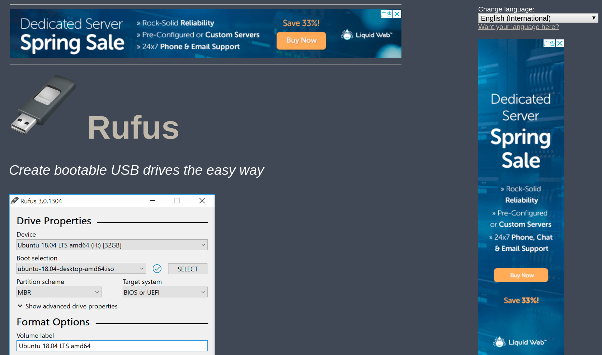

- 将页面下滑我们可以看到大大的Download点击下面的最新版本即可开始下载，在这里我们用的是Rufus 3.5版本

    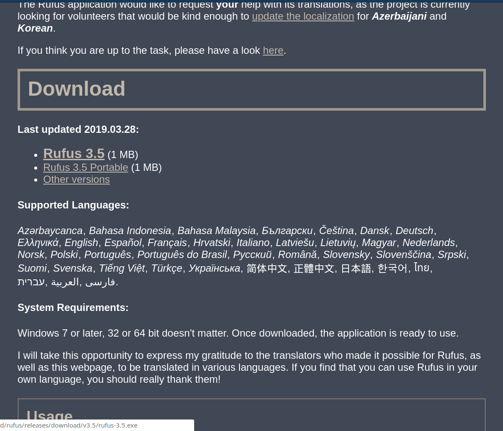

- 下载结束后我们双击我们下载文件即可打开软件

  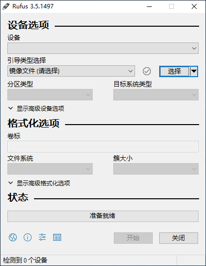

### 启动盘的写入

- 我们这时插入我们的U盘，在下面的框中会显示我们的U盘，如果你的电脑连接了多个U盘注意一定要选择正确，**制作启动盘会擦除U盘中的数据！**

    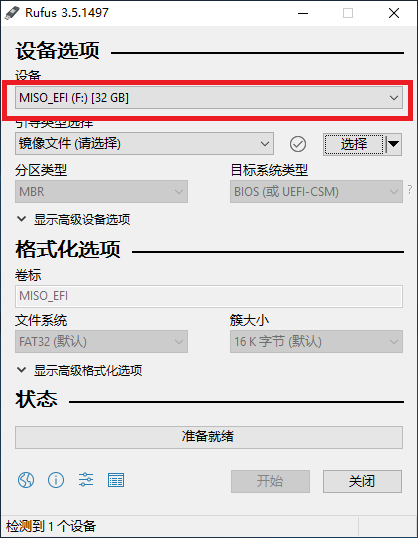
- 接着我们点击下图中的**选择**
  
    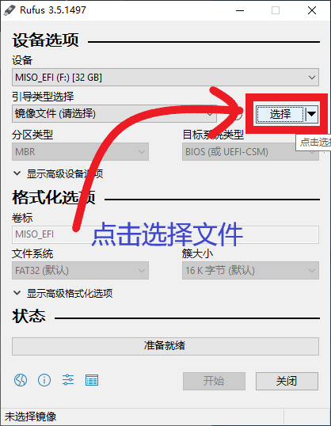

- 然后在弹出的文件选择窗里找到我们下载的系统文件并选中

    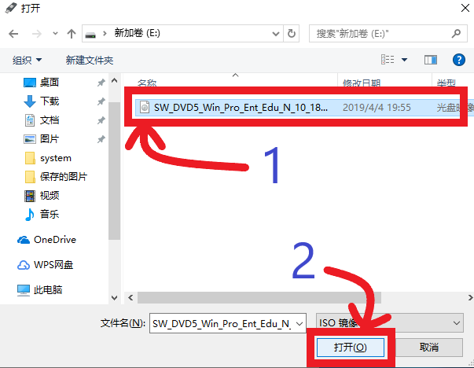

- 然后在下图中框的位置将分区类型选择为 **“MBR”** ，箭头处会显示为 **“BIOS-CSM**
    >**注意：**如果我们的电脑支持UEFI启动，那么分区推荐选择GPT，目标系统类型会是UEFI，UEFI相对于BIOS有一定的优势，不过这里为了兼容部分电脑做出了让步。如果想了解更多请直接搜索 **“UEFI+BIOS+MBR+GPT”**
  
    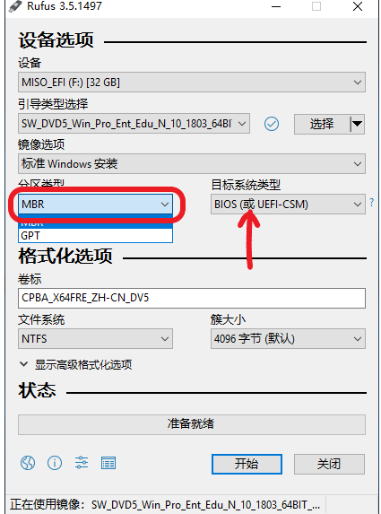

- 其余的部分我们一般不用更改，我们点击下面的开始按钮

    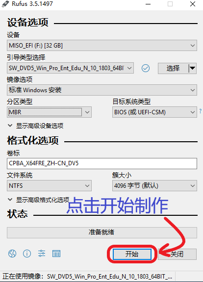

- 出现弹窗我们选择 **“确定”**

    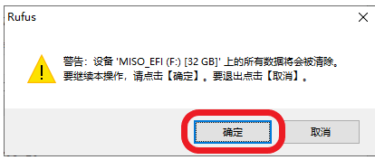

- 这时启动盘就开始制作了，下面的绿色进度条开始滚动

    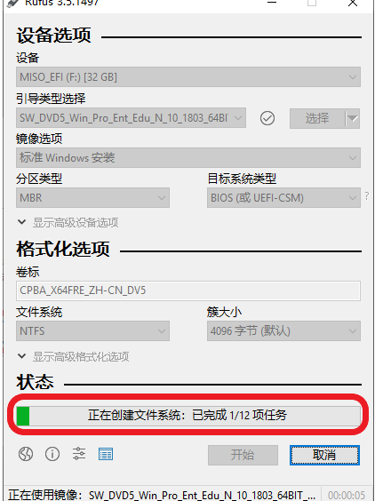

- 耐心等待几分钟，当绿色进度条充满时，我们的启动盘便做好了。

   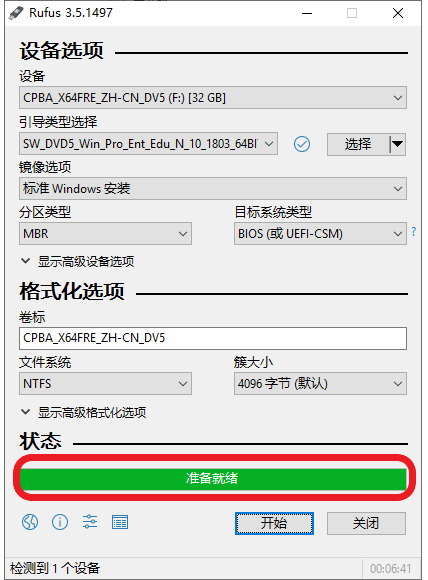

---
## 系统的安装
---

>什么是BIOS?
BIOS即Basic Input Output System(基本输入输出系统),其实，它是写在计算机主板上一个小芯片上的程序. 
我们在这里不用关注它的具体功能, 我们只要知道它控制着电脑的启动过程, 我们要在BIOS设置让电脑从u盘启动,从而开始安装系统.
跟随下面的教程我们可以轻松完成系统的安装.

### 从U盘启动

从U盘启动有两种方式，一种是临时让电脑从u盘启动，这种方式方便快捷，但不是所有主板都支持，另一种是从更改BIOS设置，繁琐但是所有主板都可以操作。我们首先来看看是不是支持临时从U盘启动

- 我们先将电脑彻底关机（长按电源键彻底关机）再按电源键开机

- 当出现品牌图标时：
  - 如果 有press xx to enter setup 字样表示我们按 xx按键进入BIOS设置界面

  - 如果 有press xx to change boot device 字样表示我们可以直接按 xx按键来

    更改启动位置

  - 如果 什么字样也没有，你可以：

    - 尝试按 **ESC** ，**Del**或**F1**到**F12** 来尝试进入BIOS或者更改启动硬盘界面

    - 我们可以通过搜索“电脑品牌 + BIOS”来确认如何进入BISO或者我们可以在出现品牌logo时
  
比如下图这台Acer电脑，我们可以按F12直接更改启动硬盘，也可以按F2进BIOS设置

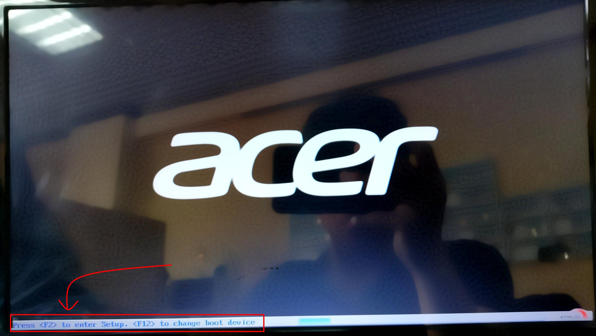

**注意： 如果我们的电脑可以进入更改启动硬盘界面，那我们优先选择更改启动硬盘的方式**
下面我们来以这台Acer为例子来介绍这两种方式

- 方式一   直接从u盘启动
  - 出现品牌logo时，根据上图的文字提示 我们按**F12** 进入选择启动硬盘界面

    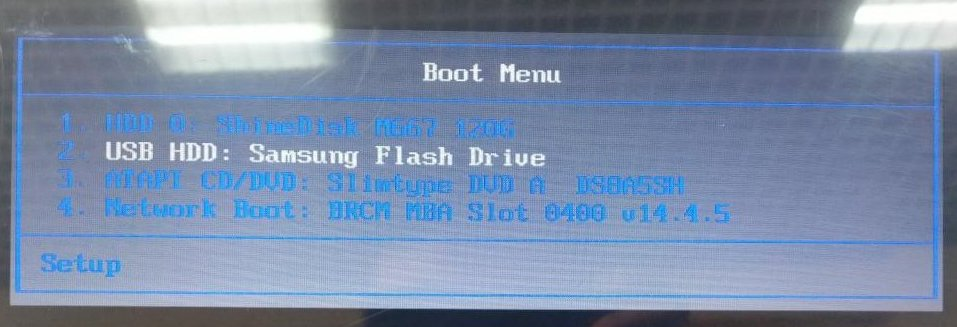

  - 我们上下按上下键可以选择要启动的硬盘，在这里我们选择我们的启动盘（U盘），然后回车确认启动
  - 见到win徽标就成功启动了。

  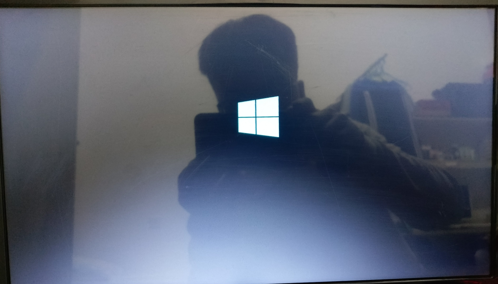 

- 方式二   进BIOS修改启动顺序
  
    虽然BIOS有好几种，但不同的BIOS设置都大同小异，如果实在不清楚的，我们可以搜索 **“电脑型号+BIOS”** 或者 **“主板型号+BIOS”** 寻找教程
    
    下面以这台Acer为例来介绍

  - 开机时按照出现品牌logo的指示按**F2**，进入**BIOS**

  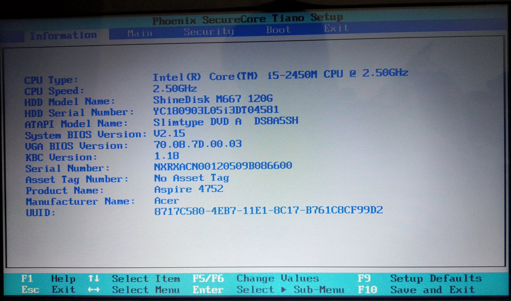

  - 然后我们通过左右键移动到Boot（启动）选项卡

  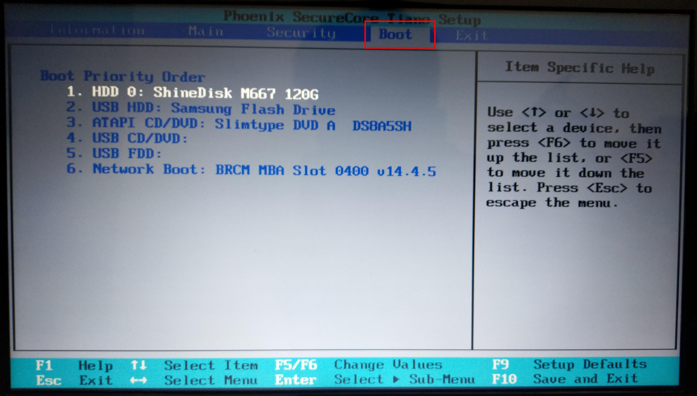

  - 在这里我们可以看到一个列表，电脑启动时将从列表第一项尝试启动，如果不能启动则尝试第二项，直到启动成功。我们需要做的是将我们的启动盘放到第一位。我们根据提示，使用上下键选中我们的启动盘，然后使用F5或者F6将选中的项目上下移动，**将我们的启动盘移到第一位**！

  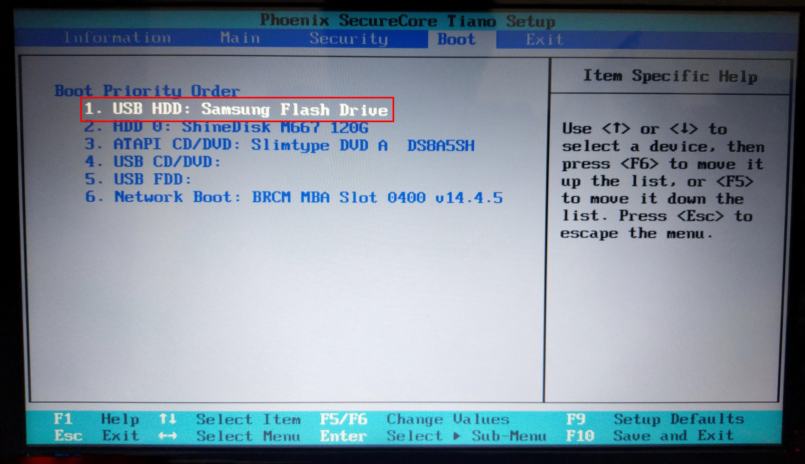

  - 根据屏幕下方的提示，我们按**F10**然后左右选中**YES**然后回车进行保存并开始启动。

   
  - 见到win徽标就成功引导了。

   

### 安装系统

OK 恭喜，你已经完成了最难的部分，下面就简单多了，我们很快就能体验新系统了。
Win徽标页面之后会出现下面的页面，根据需要选择即可。然后点击下一步

- 稍等一会你会看到下面的画面，点击现在安装。

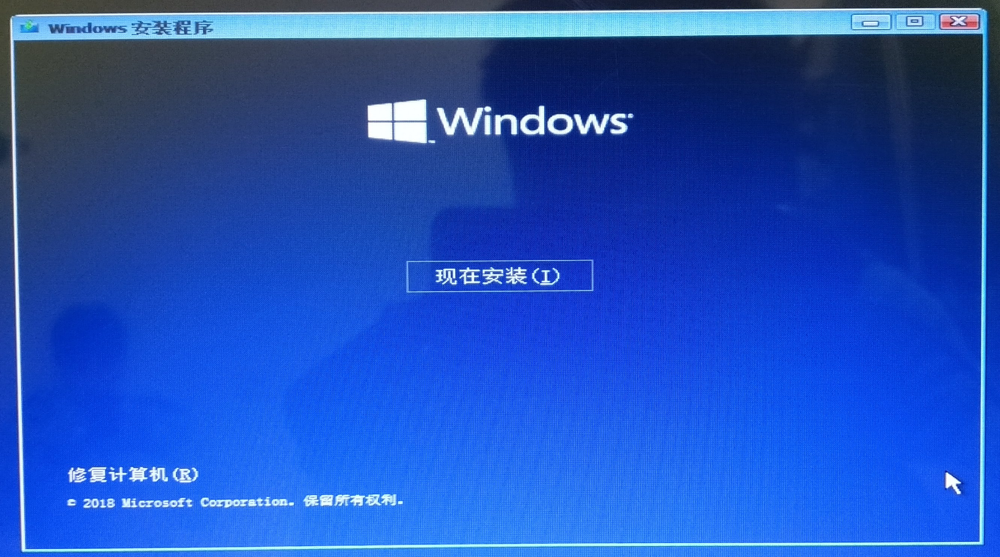

- 稍等片刻你会看到下面的页面，这时我们选择专业版（推荐专业版，其他版本后续激活过程可能不是很顺利）。然后点击下一步

  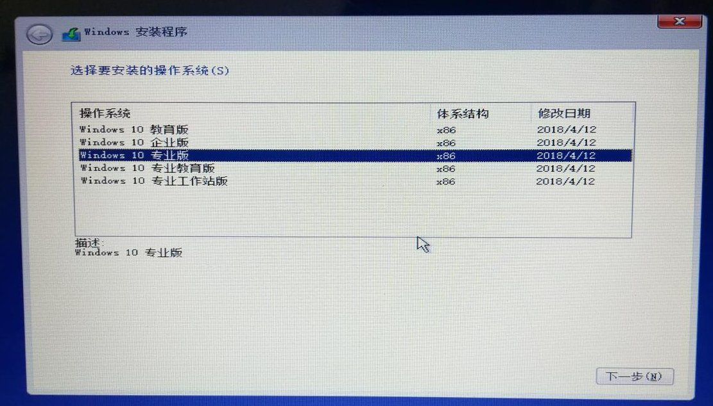

- 接下来我们在 ‘我接受许可条款’ 前打钩，然后点击下一步

  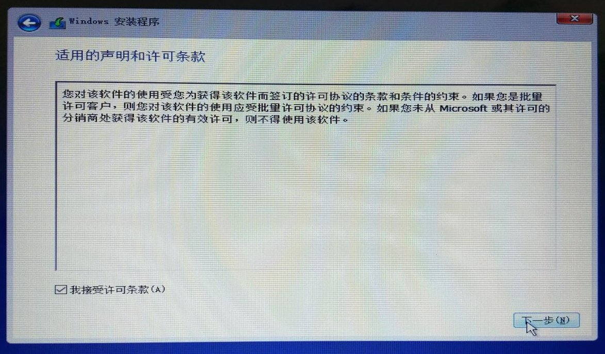

- 接下来你会看到安装类型选择的窗口。这里需要解释一下，如果你选择升级，他会将之前你的win系统（如果有）的设置与程序保留，并且有一定的概率出现问题，不推荐。我们这里只介绍第二项，自定义。

  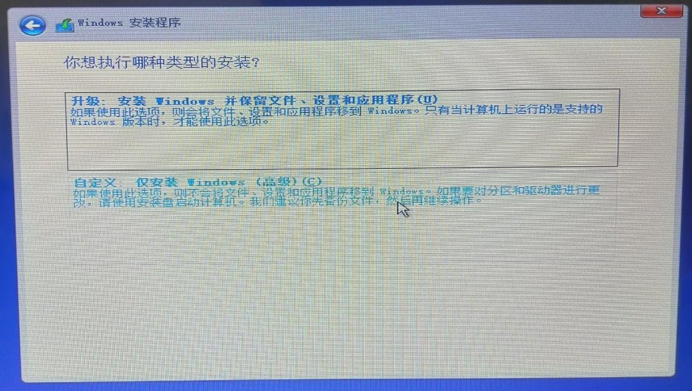

- 接下来是分区与选择安装位置，这里我们先说一下分区原则。
  - 如果电脑只有一个硬盘。
        我们需要创建一个系统的分区（将来的C盘），一个自己的数据分区（将来的D盘），我们不推荐创建过多的分区。这样会使得以后的文件管理变得非常繁杂。

  - 如果是多硬盘
        我们一般直接选择一个硬盘来装装系统，其余硬盘来作为数据盘即可。对于最常见的**1个固态硬盘加一个机械盘**，我们直接将系统安装在固态硬盘，整个固态作为C盘，将机械硬盘分一个区作为将来的D盘。固态硬盘作为C盘的好处是系统启动快，软件可以达到秒开的效果（前提是日常使用的时候将软件装在C盘），机械盘一般较大，我们可以储存我们的个人数据。
  - 关于分区大小
        原则上，我们装系统的盘容量不要小于100G否则，你的系统盘会很快被应用填满。但是我们的c盘也没必要过大。一般120G-200G就可以了。对于数据盘，我们将除了系统盘和保留分区以外的所有空间全部给数据盘就行。

- 下图中驱动器0就是我们说的硬盘0，且这个磁盘的大小只有111.8G。显然这台电脑只有一个硬盘，我们需要一个分区给系统一个分区给数据。虽然原则上C要100G以上，但是考虑到这台电脑磁盘太小，我们就分给系统50G的空间，其余作为数据分区。我们先分配系统分区。首先选中驱动器0，然庵后点击下方新建图标。

    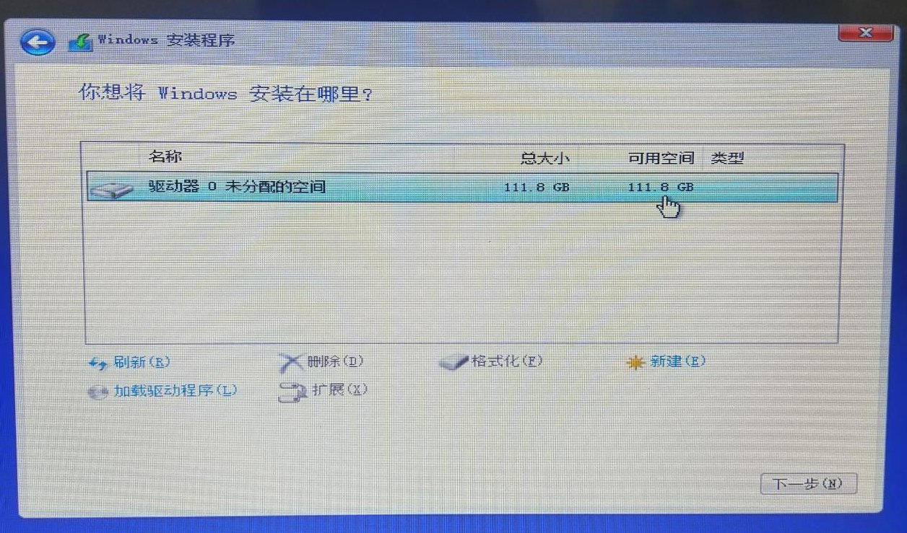

- 这时，下方出现了一个输入框，这个框中输入要分区的大小，注意单位是M，1G=1024M，所以这里我们输入51200。然后点击应用。

    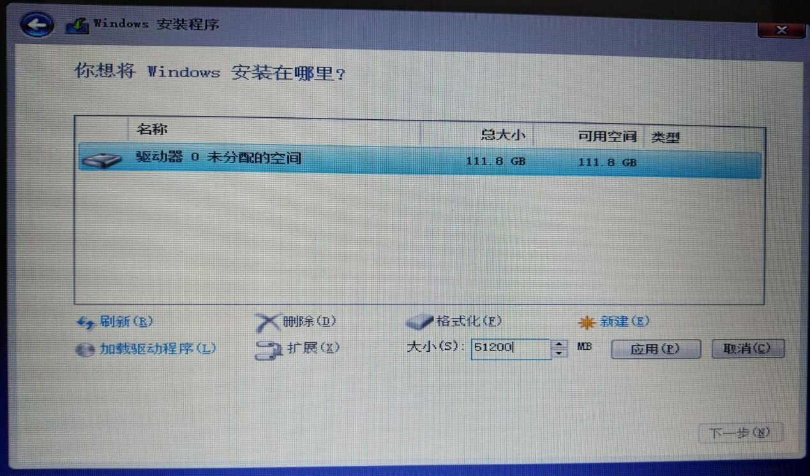

- 弹出图中的框意思是安装程序会创建一些额外的保留分区。我们直接选择确定。

    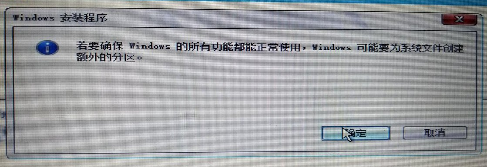

- 接下来你看到了驱动器0出现了两个分区，一个549.0MB的“分区1”的系统分区（这个就是上图弹窗中提示的额外分区）和另一个49.5GB的主分区（我们分的装系统的分区）。还有剩余的61.8GB的未分配分区（我们将要分给数据盘的分区）。
接下来我们给数据盘分区。首先我们选中未分配的空间。

    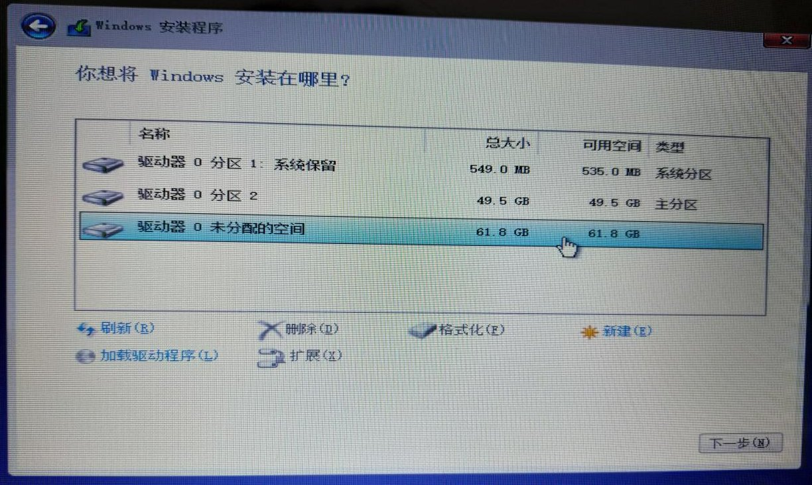

- 点击新建，默认是使用所有未分配的空间。我们要使用剩余所以的空间，所以直接点击应用。
    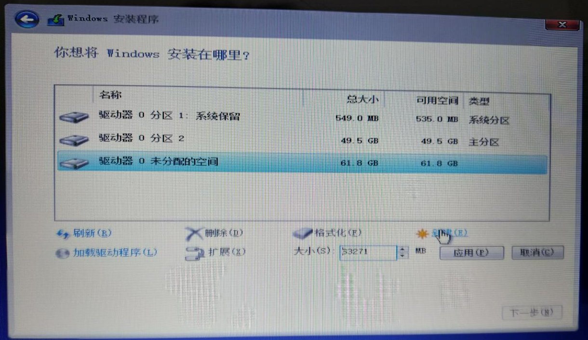

- 这时未分配的空间变成了 驱动器0分区3，这个就是我们的数据分区（将来的D盘）了。
接下来就是写入系统的过程，我们**选择刚刚为系统分的分区2**，然后点击下一步。

    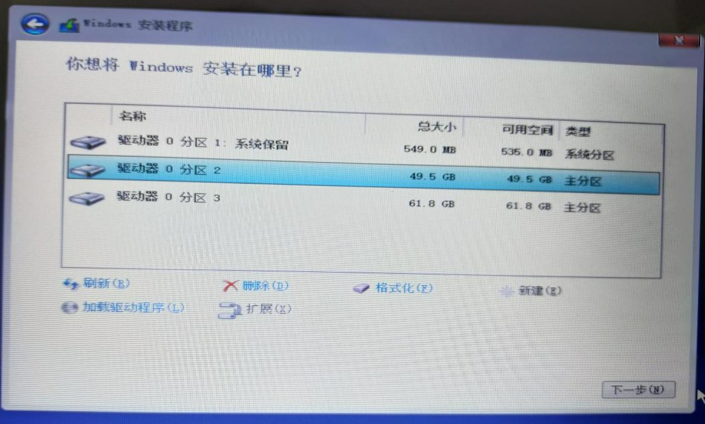

- 出现下图就是系统在安装了

    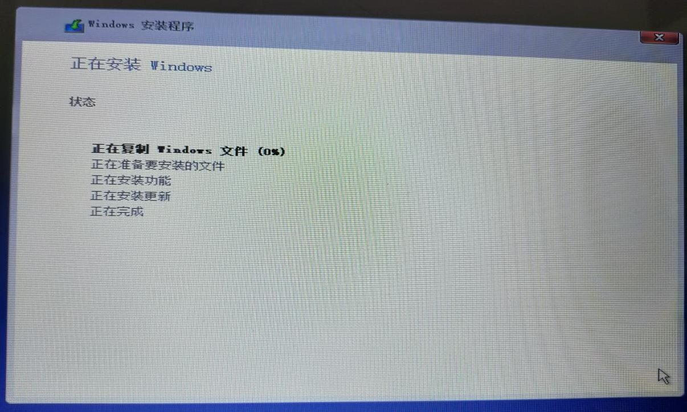

- 出现下图时表示系统写入已经完成，需要重启。**注意，此时我们要拔下U盘，然后点击重新启动。**

    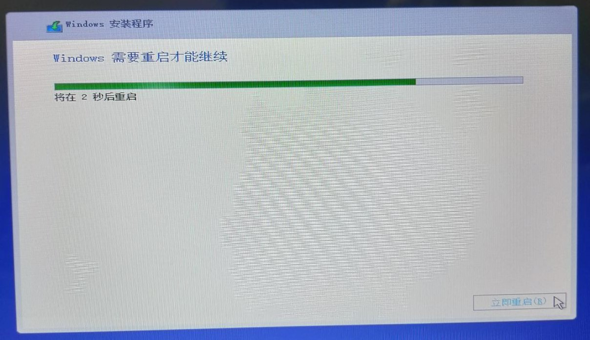

- 出现下图，这是windows在为你设置该电脑进行准备。

    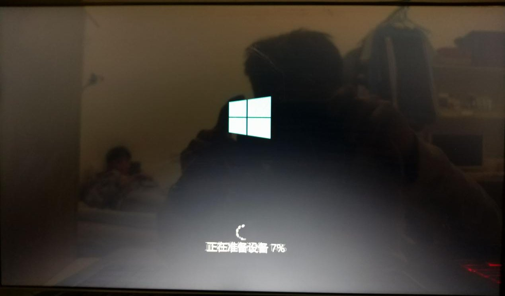

- 耐心等待一段时间，系统会引导我们进行初始化设置。这部分比较简单，聪明的你可以轻松搞定，这里就不再赘述啦！

---

## 系统的激活

---

现在我们的电脑已经愉快的开机了,然而我们发现我们没法换壁纸,主题等.这是由于我们的电脑并没有激活.激活的方法很简单,按照下面的步骤你可以迅速的完成激活.
1. 连接到校园网

2. 打开浏览器进入[ms.ynu.edu.cn ](ms.ynu.edu.cn ) 并点击激活客户端下载

   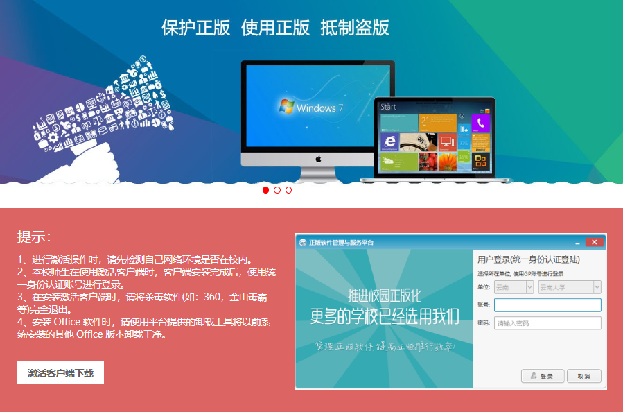

3. 页面会跳转到统一身份认证页面，输入学号密码进行认证

   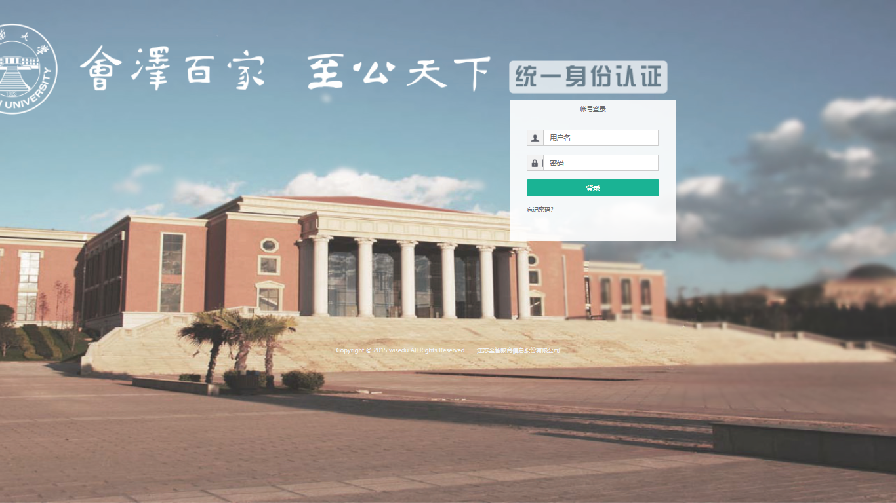

4. 认证成功后会跳转回之前的页面，我们再次点击下载即可开始下载!

   

5. 我们双击运行激活客户端，出现下面页面我们选择 **“运行”**

   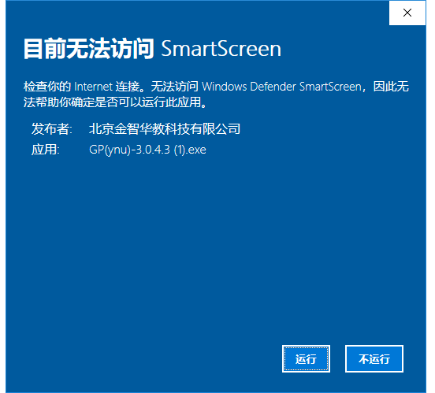

6. 打开激活软件后使用统一身份认证登录

   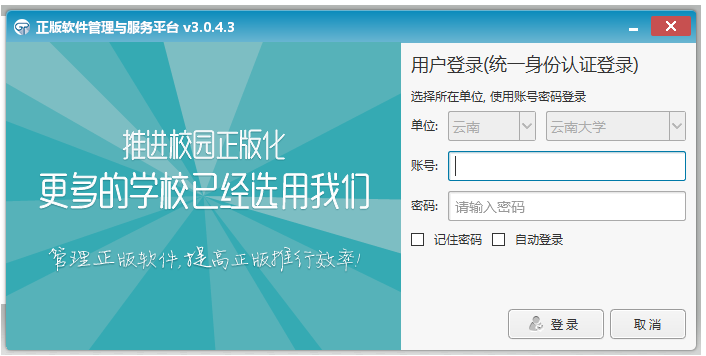

7. 把windows激活那个开关打开

   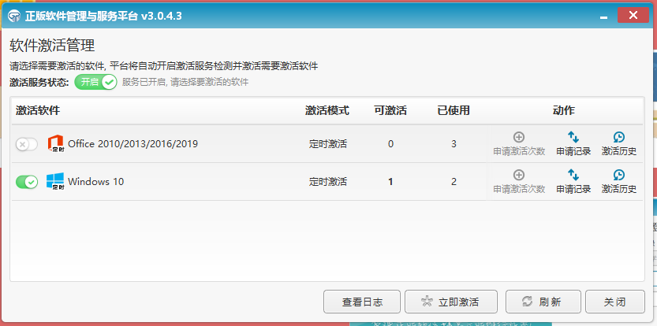

8. 点击下面激活按钮稍等数秒即可激活

   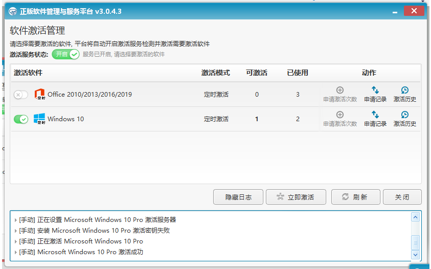

## 恭喜

&nbsp;

&nbsp;

&nbsp;

&nbsp;

&nbsp;

&nbsp;

&nbsp;

&nbsp;

# 你可以愉快的使用电脑了！O(∩_∩)O~~
